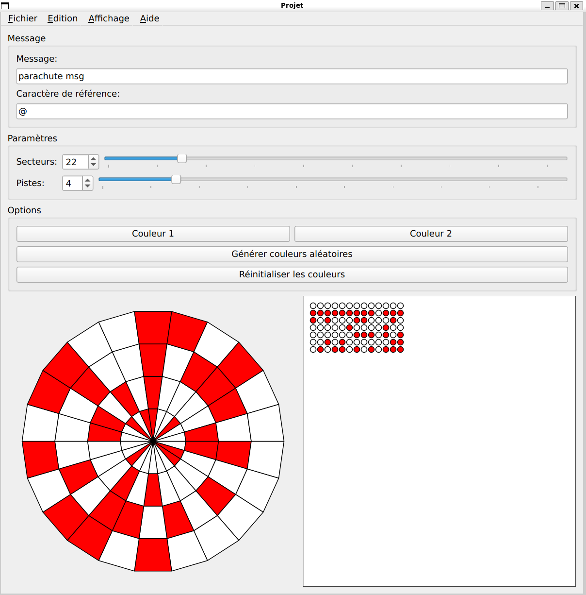
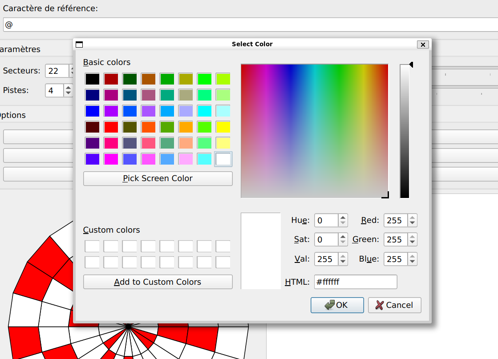
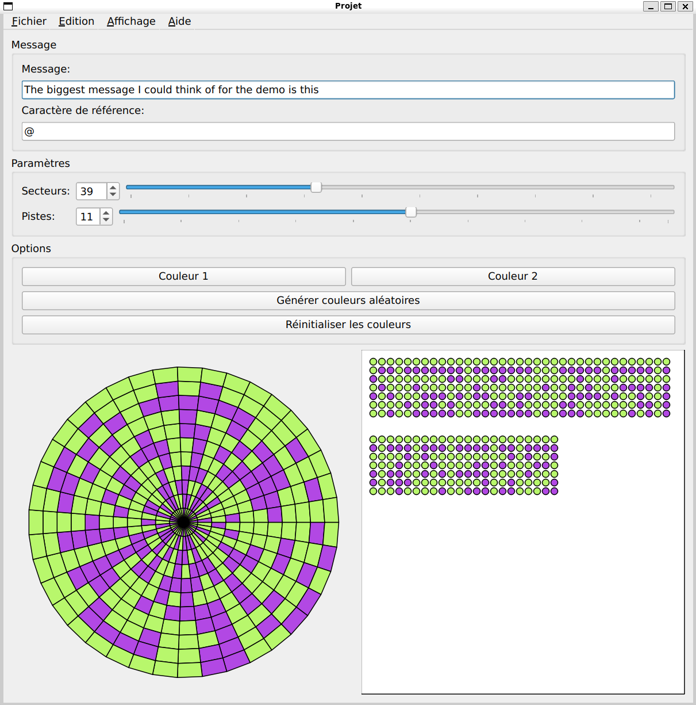

# 🚀 Perseverence's Parachute Secret Message Encoder
Inspired by the binary coding of NASA's Perseverance rover parachute, I developed a Qt-based C++ application that functions as a secret message encoder. The application transforms text inputs into innovative geometric patterns, offering unique circular and binary visualizations of the encoded data.
---

## 📸 Demo & Screenshots

### Main Interface


### Using a simple message


### Customizing the colors 


### Adding more details to the wheel / Randomizing colors 


---

## 🧠 About the Project

This project is a **Qt-based application** developed as part of an engineering school assignment.  
It simulates and analyzes **parachute deployment**, including physics calculations, UI display, and real-time parameter visualization.

Key focuses include:

- Modeling parachute geometry  
- Real-time simulation with Qt  
- UI design using Qt Widgets  
- Collaboration and version control  
- Engineering problem-solving workflow  

---

## ✨ Features

-  **Interactive GUI** built with Qt  
-  **Parachute deployment simulation**  
-  **Live visualization** of forces & trajectory  
-  Clean project structure with modular C++ classes  
-  Cross-platform support (Linux, Windows, macOS)

### Run from Terminal
Here’s the usage section you can drop directly into your README:

## Usage

### Run using Qt Creator (recommended)
1. Open the file `Projet.pro` in **Qt Creator**
2. Select your build kit (GCC/Clang/MSVC)
3. Click **Build**
4. Click **Run**

### Run from Terminal

```bash
qmake Projet.pro
make
./Projet
